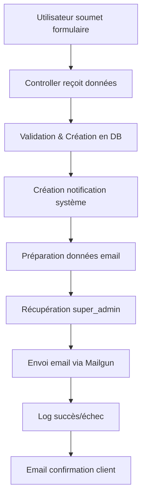

# 📧 Système d'envoi d'emails aux Super Admin

## 🎯 Vue d'ensemble

Ce système envoie automatiquement des emails aux super_admin pour toutes les actions utilisateurs importantes sur la plateforme Excellium Conseils.

---

## 🏗️ Architecture

### 1️⃣ Fichiers créés

```
app/
├── Mail/
│   └── SuperAdminNotification.php          # Classe Mailable
├── Services/
│   └── SuperAdminNotificationService.php   # Service d'envoi centralisé
└── Http/Controllers/
    ├── formationsController.php            # ✅ Intégré
    ├── EmploiController.php                # ✅ Intégré
    └── OpportuniteController.php           # ✅ Intégré

resources/views/emails/
└── super-admin-notification.blade.php      # Vue email fallback
```

---

## 🔧 Configuration Mailgun

### Template créé : `notification-super-admin`

**Détails** :
- **Nom** : `notification-super-admin`
- **Sujet** : `🔔 Nouvelle action utilisateur : {{action_type}}`
- **Responsive** : ✅ Oui (mobile-friendly)
- **Support Handlebars** : v3

---

## 📋 Événements notifiés

| **Événement** | **Controller** | **Méthode** | **Statut** |
|---------------|---------------|-------------|------------|
| Inscription formation | `formationsController` | `participer()` | ✅ Intégré |
| Changement statut formation | `formationsController` | `changerStatutInscription()` | ✅ Intégré |
| Candidature emploi | `EmploiController` | `postuler()` | ✅ Intégré |
| Postulation opportunité | `OpportuniteController` | `candidater()` | ✅ Intégré |
| Souscription service | `ServiceController` | `inscriptionAjax()` | ✅ Intégré |
| Sélection produit | `ProduitController` | `selectionner()` | ✅ Intégré |

---

## 🛠️ Utilisation

### Exemple d'intégration

```php
use App\Services\SuperAdminNotificationService;

// Après la création d'une inscription/candidature/postulation

// ✅ ENVOYER EMAIL AUX SUPER_ADMIN
try {
    $emailData = SuperAdminNotificationService::prepareFormationInscriptionData($inscription, $formation);
    SuperAdminNotificationService::sendNotification($emailData);
    Log::info("Email envoyé aux super_admin");
} catch (\Exception $e) {
    Log::error("Erreur envoi email super_admin: " . $e->getMessage());
}
```

---

## 📊 Méthodes disponibles dans le Service

### `SuperAdminNotificationService::sendNotification(array $data)`

Envoie un email à tous les super_admin avec les données fournies.

**Paramètres** :
- `$data` : Tableau associatif contenant les variables du template

**Retour** : `bool` (true si succès, false si échec)

---

### `SuperAdminNotificationService::prepareFormationInscriptionData($inscription, $formation)`

Prépare les données pour une inscription formation.

**Retour** :
```php
[
    'action_type' => 'Nouvelle inscription à une formation',
    'action_description' => '...',
    'user_name' => '...',
    'user_email' => '...',
    'entity_type' => 'Formation',
    'entity_name' => '...',
    // ...
]
```

---

### `SuperAdminNotificationService::prepareEmploiCandidatureData($candidature, $emploi)`

Prépare les données pour une candidature emploi.

---

### `SuperAdminNotificationService::prepareOpportunitePostulationData($postulation, $opportunite)`

Prépare les données pour une postulation opportunité.

---

### `SuperAdminNotificationService::prepareServiceInscriptionData($inscription, $service)`

Prépare les données pour une souscription service.

---

### `SuperAdminNotificationService::prepareProduitSelectionData($selection, $produit, $user)`

Prépare les données pour une sélection produit.

---

## 🎨 Variables du template Mailgun

### Variables obligatoires

```json
{
  "action_type": "Nouvelle inscription à une formation",
  "action_description": "Un utilisateur vient de s'inscrire à une formation",
  "alert_type": "info",
  "user_name": "Jean Dupont",
  "user_email": "jean.dupont@example.com",
  "action_date": "30/10/2025 à 15:45",
  "entity_type": "Formation",
  "entity_name": "Gestion de Projet Agile",
  "badge_type": "info",
  "dashboard_link": "https://excelliumconseils.com/admin/...",
  "admin_notifications_link": "https://excelliumconseils.com/admin/notifications/manage",
  "current_year": "2025",
  "website_url": "https://excelliumconseils.com"
}
```

### Variables optionnelles

```json
{
  "user_phone": "+237 6XX XX XX XX",
  "entity_description": "Formation de 3 jours",
  "additional_info": "Paiement effectué",
  "entity_status": "En attente",
  "status_badge": "warning",
  "user_profile_link": "https://...",
  "unsubscribe_url": "https://..."
}
```

---

## 🎯 Types d'alertes et badges

### Alert Types (`alert_type`)
- `info` → Bleu (informations générales)
- `success` → Vert (succès)
- `warning` → Jaune (attention requise)
- `danger` → Rouge (urgent)

### Badge Types (`badge_type`, `status_badge`)
- `info` → Badge bleu
- `success` → Badge vert
- `warning` → Badge jaune
- `danger` → Badge rouge

---

## 🔄 Workflow complet



---

## 🧪 Tests

### ⚡ Test rapide avec la commande Artisan

```bash
# Tester tous les types d'emails
php artisan email:test-super-admin

# Tester un type spécifique
php artisan email:test-super-admin formation
php artisan email:test-super-admin emploi
php artisan email:test-super-admin opportunite
php artisan email:test-super-admin service
php artisan email:test-super-admin produit
```

Cette commande va :
- ✅ Vérifier qu'il y a des super_admin en DB
- ✅ Envoyer des emails de test pour chaque type
- ✅ Afficher les résultats dans la console
- ✅ Logger tout dans `storage/logs/laravel.log`

### Tester manuellement

1. **Vérifier les super_admin** :
   ```sql
   SELECT id, name, email FROM users WHERE type = 'super_admin';
   ```

2. **Créer une inscription test** :
   - Aller sur la page d'une formation
   - S'inscrire avec des données valides
   - Vérifier les logs Laravel : `storage/logs/laravel.log`

3. **Vérifier dans Mailgun** :
   - Dashboard Mailgun → Logs
   - Chercher "Nouvelle action utilisateur"

---

## 📊 Logs et Debugging

### Logs créés automatiquement

```php
// Dans storage/logs/laravel.log

[2025-10-30 15:45:10] local.INFO: Email envoyé au super_admin: admin@example.com pour action: Nouvelle inscription à une formation

[2025-10-30 15:45:12] local.ERROR: Erreur lors de l'envoi de notification aux super_admin: Connection timeout
```

### Commandes utiles

```bash
# Voir les logs en temps réel
tail -f storage/logs/laravel.log

# Rechercher les emails super_admin
grep "super_admin" storage/logs/laravel.log

# Vider les caches
php artisan cache:clear
php artisan view:clear
php artisan config:clear
```

---

## ⚙️ Configuration requise

### Variables d'environnement (`.env`)

```env
MAIL_MAILER=mailgun
MAILGUN_DOMAIN=mg.excelliumconseils.com
MAILGUN_SECRET=key-xxxxxxxxxxxxxx
MAILGUN_ENDPOINT=https://api.eu.mailgun.net

APP_URL=https://excelliumconseils.com
```

---

## 🚨 Gestion des erreurs

Le système est conçu pour être **non-bloquant** :

- ❌ Si l'envoi échoue → L'inscription/candidature est quand même créée
- 📝 L'erreur est loggée
- 🔄 Possibilité de réessayer manuellement

```php
// Exemple d'erreur gérée
try {
    SuperAdminNotificationService::sendNotification($emailData);
} catch (\Exception $e) {
    Log::error("Erreur envoi email: " . $e->getMessage());
    // L'application continue normalement
}
```

---

## 📈 Statistiques

### Récupérer le nombre de super_admin

```php
use App\Services\SuperAdminNotificationService;

$superAdmins = SuperAdminNotificationService::getSuperAdmins();
$count = $superAdmins->count();

echo "Nombre de super_admin : {$count}";
```

---

## 🔐 Sécurité

- ✅ Seuls les utilisateurs avec `type = 'super_admin'` reçoivent les emails
- ✅ Les emails contiennent des liens directs vers le dashboard
- ✅ Les données sensibles ne sont pas incluses dans les emails
- ✅ Utilisation de HTTPS pour tous les liens

---

## ✅ Intégrations terminées

### ServiceController
- [x] Méthode `inscriptionAjax()`
- [x] Envoyer email aux super_admin
- [x] Route publique : `POST /inscription/services`
- [x] Route admin : `GET /admin/services/inscriptions/list`

### ProduitController
- [x] Méthode `selectionner()` créée
- [x] Méthode `listUserProduits()` créée
- [x] Envoyer email aux super_admin
- [x] Route publique : `POST /produit/selectionner`
- [x] Route admin : `GET /admin/produits/selections`

### Commande de test
- [x] `php artisan email:test-super-admin` créée
- [x] Support de tous les types d'événements
- [x] Paramètres optionnels pour tester un type spécifique

---

## 🎨 Personnalisation du template

Pour modifier le template email dans Mailgun :

1. Aller sur [Mailgun Dashboard](https://app.eu.mailgun.com/)
2. Sending → Templates
3. Sélectionner `notification-super-admin`
4. Modifier le HTML/CSS
5. Sauvegarder

**⚠️ Important** : Garder les variables Handlebars `{{variable_name}}` intactes !

---

## ✅ Checklist de déploiement

- [x] Template Mailgun créé
- [x] Classe Mail créée
- [x] Service centralisé créé
- [x] FormationsController intégré
- [x] EmploiController intégré
- [x] OpportuniteController intégré
- [x] ServiceController intégré
- [x] ProduitController intégré
- [x] Commande de test créée
- [ ] Tests en production
- [ ] Documentation utilisateur

### 🎯 Prochaines étapes recommandées

1. **Créer un super_admin test** :
   ```sql
   UPDATE users SET type = 'super_admin' WHERE id = 1;
   ```

2. **Tester l'envoi d'emails** :
   ```bash
   php artisan email:test-super-admin
   ```

3. **Vérifier les logs** :
   ```bash
   tail -f storage/logs/laravel.log
   ```

4. **Configurer Mailgun en production** :
   - Vérifier le domaine dans Mailgun
   - Tester avec des vrais emails
   - Monitorer les logs Mailgun

---

## 📞 Support

En cas de problème :

1. Vérifier les logs Laravel
2. Vérifier les logs Mailgun
3. Vérifier la configuration `.env`
4. Vérifier que des super_admin existent en DB

---

## 🆕 Nouveautés dans cette version

### ServiceController
- **Méthode existante** : `inscriptionAjax()` - Gère déjà les inscriptions aux services
- **Ajout** : Envoi d'email aux super_admin après chaque inscription
- **Localisation** : Ligne 181-196 de `ServiceController.php`

### ProduitController
- **Nouvelle méthode** : `selectionner()` - Permet aux utilisateurs de sélectionner un produit
- **Nouvelle méthode** : `listUserProduits()` - Liste toutes les sélections dans l'admin
- **Ajout** : Envoi d'email aux super_admin après chaque sélection
- **Localisation** : Lignes 147-259 de `ProduitController.php`

### Routes ajoutées
```php
// Routes publiques
POST /inscription/services          → ServiceController@inscriptionAjax
POST /produit/selectionner          → ProduitController@selectionner

// Routes admin
GET /admin/services/inscriptions/list → ServiceController@listUserServices
GET /admin/produits/selections        → ProduitController@listUserProduits
```

### Nouvelle commande Artisan
```bash
php artisan email:test-super-admin [type]
```

Types disponibles : `formation`, `emploi`, `opportunite`, `service`, `produit`, ou aucun pour tous.

---

**Dernière mise à jour** : 30/10/2025
**Version** : 2.0.0 - ✅ COMPLET

